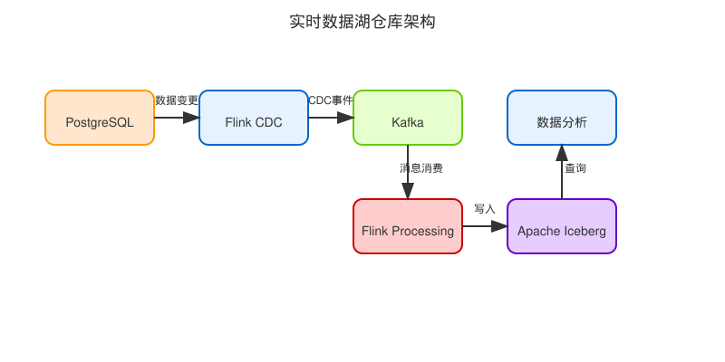

# 数据湖实时数仓

基于 PostgreSQL + Flink CDC + Kafka + Flink + Iceberg 的实时数据仓库解决方案。

## 项目架构



## 技术栈

- **PostgreSQL**: 源数据库
- **Flink CDC**: 捕获数据库变更
- **Kafka**: 消息队列，实现数据缓冲和解耦
- **Flink**: 流处理引擎
- **Apache Iceberg**: 数据湖表格式

## 开发环境要求

- JDK 11+
- Docker & Docker Compose
- Make
- Git

## 快速开始

1. 克隆仓库:
```bash
git clone https://github.com/yourusername/dataworkshub.git
cd dataworkshub
```

2. 配置环境变量:
```bash
cp .env.example .env
# 编辑 .env 文件配置相关参数
```

3. 启动服务:
```bash
make up
```

4. 访问服务:
   - Flink Dashboard: http://localhost:8081

## 项目结构

```
dataworkshub/
├── .github/            # GitHub Actions 配置
├── docs/               # 文档
├── src/                # 源代码
│   ├── main/           # 主代码
│   └── test/           # 测试代码
├── docker/             # Docker 相关配置
├── scripts/            # 脚本
├── .env.example        # 环境变量示例
├── docker-compose.yml  # Docker Compose 配置
├── Dockerfile          # Docker 镜像构建文件
├── Makefile            # Make 构建文件
└── README.md           # 项目说明
```

## 许可证

[MIT](LICENSE) 