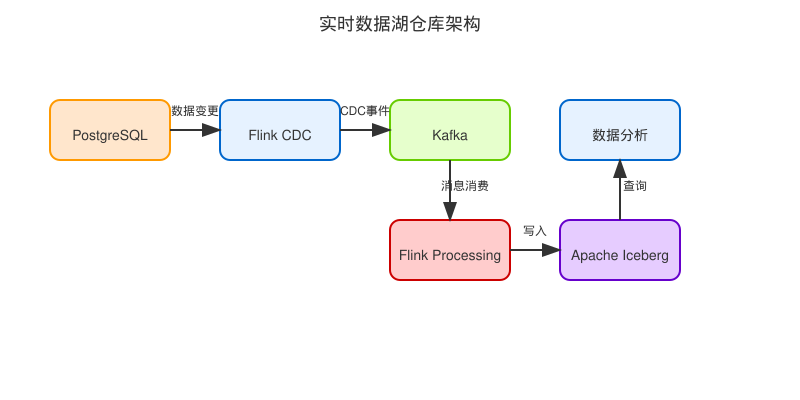

# 构建实时数据湖仓库：PostgreSQL+Flink CDC+Kafka+Flink+Iceberg架构详解

## 引言

在当今数据驱动的商业环境中，企业需要实时分析数据以做出明智决策。传统的数据仓库架构往往依赖于批处理ETL流程，这会导致分析洞察与业务事件之间存在延迟。本文介绍一种现代化的实时数据仓库架构，它结合了PostgreSQL、Apache Flink CDC、Apache Kafka、Apache Flink和Apache Iceberg的强大功能，实现从源数据到分析的端到端实时处理。

## 架构概述

我们的实时数据湖仓库架构由以下关键组件组成：

1. **PostgreSQL**：作为源数据库，存储业务事务数据
2. **Flink CDC**：捕获PostgreSQL中的数据变更(Change Data Capture)
3. **Apache Kafka**：作为消息队列，缓冲数据变更事件并提供解耦
4. **Apache Flink**：处理流数据并执行转换
5. **Apache Iceberg**：提供表格式化的数据湖存储

这种架构具有以下优势：

- **低延迟**：近实时地将业务数据变更反映到分析层
- **弹性扩展**：各组件均可独立扩展以满足不同的性能需求
- **数据一致性**：Iceberg提供ACID事务支持，确保数据一致性
- **Schema演进**：支持架构变更而不中断数据处理
- **历史查询能力**：支持时间旅行查询和数据回溯



## 渐进式实现路线图

我们将采用渐进式的方法实现这个架构，分为以下几个阶段：

### 第一阶段：环境搭建

1. 设置基础的Docker环境
2. 配置PostgreSQL数据库
3. 准备基本的项目结构

### 第二阶段：实现CDC基础功能

1. 集成Flink CDC连接器
2. 配置Kafka并实现CDC数据流入Kafka

### 第三阶段：数据处理与转换

1. 开发Flink流处理作业
2. 实现数据转换和丰富化逻辑

### 第四阶段：Iceberg集成

1. 配置Iceberg表
2. 将处理后的数据写入Iceberg

### 第五阶段：查询与分析层

1. 配置查询引擎
2. 实现分析仪表板

## 第一阶段：环境搭建

### 基础环境配置

首先，我们需要准备一个稳定的开发环境。我们使用Docker和Docker Compose来确保环境的一致性和可重现性。

#### 环境变量配置

我们使用`.env`文件管理环境变量:

```
KAFKA_GROUP=data_lake_group
KAFKA_TOPIC=postgresql_cdc
KAFKA_URL=kafka:9092

FLINK_VERSION=1.16.0
JAVA_VERSION=11

POSTGRES_URL=jdbc:postgresql://postgres:5432/postgres
JDBC_BASE_URL=jdbc:postgresql://postgres:5432
POSTGRES_USER=postgres
POSTGRES_PASSWORD=postgres
POSTGRES_DB=postgres
```

#### Dockerfile

我们的Dockerfile基于官方Flink镜像，并增加了所需的依赖：

```dockerfile
FROM flink:1.16.2

# 安装JDK 11
RUN apt-get update && \
    apt-get install -y openjdk-11-jdk && \
    apt-get clean;

# 设置环境变量
ENV JAVA_HOME=/usr/lib/jvm/java-11-openjdk-amd64

# 下载连接器库
RUN wget -P /opt/flink/lib/ https://repo.maven.apache.org/maven2/org/apache/flink/flink-sql-connector-kafka/1.16.2/flink-sql-connector-kafka-1.16.2.jar && \
    wget -P /opt/flink/lib/ https://repo.maven.apache.org/maven2/org/apache/flink/flink-connector-jdbc/1.16.2/flink-connector-jdbc-1.16.2.jar && \
    wget -P /opt/flink/lib/ https://repo1.maven.org/maven2/org/postgresql/postgresql/42.2.26/postgresql-42.2.26.jar && \
    wget -P /opt/flink/lib/ https://repo.maven.apache.org/maven2/org/apache/flink/flink-sql-connector-postgres-cdc/2.3.0/flink-sql-connector-postgres-cdc-2.3.0.jar && \
    wget -P /opt/flink/lib/ https://repo.maven.apache.org/maven2/org/apache/iceberg/iceberg-flink-runtime-1.16/1.3.0/iceberg-flink-runtime-1.16-1.3.0.jar

WORKDIR /opt/flink
```

#### Docker Compose 配置

我们的`docker-compose.yml`文件定义了完整的服务栈：

```yaml
version: '3'

services:
  # PostgreSQL数据库
  postgres:
    image: postgres:14
    container_name: postgres
    ports:
      - "5432:5432"
    environment:
      - POSTGRES_USER=${POSTGRES_USER:-postgres}
      - POSTGRES_PASSWORD=${POSTGRES_PASSWORD:-postgres}
      - POSTGRES_DB=${POSTGRES_DB:-postgres}
    volumes:
      - postgres_data:/var/lib/postgresql/data
      - ./scripts/init-db.sql:/docker-entrypoint-initdb.d/init-db.sql

  # Zookeeper服务（Kafka依赖）
  zookeeper:
    image: wurstmeister/zookeeper:3.4.6
    container_name: zookeeper
    ports:
      - "2181:2181"

  # Kafka消息队列
  kafka:
    image: wurstmeister/kafka:2.13-2.8.1
    container_name: kafka
    ports:
      - "9092:9092"
    environment:
      - KAFKA_ADVERTISED_HOST_NAME=kafka
      - KAFKA_ZOOKEEPER_CONNECT=zookeeper:2181
      - KAFKA_CREATE_TOPICS=${KAFKA_TOPIC:-postgresql_cdc}:1:1
    depends_on:
      - zookeeper
    volumes:
      - kafka_data:/var/lib/kafka/data

  # Flink JobManager
  jobmanager:
    build: .
    image: datalake-flink:latest
    container_name: jobmanager
    ports:
      - "8081:8081"
    environment:
      - POSTGRES_URL=${POSTGRES_URL:-jdbc:postgresql://postgres:5432/postgres}
      - POSTGRES_USER=${POSTGRES_USER:-postgres}
      - POSTGRES_PASSWORD=${POSTGRES_PASSWORD:-postgres}
      - POSTGRES_DB=${POSTGRES_DB:-postgres}
      - KAFKA_URL=${KAFKA_URL:-kafka:9092}
      - |
        FLINK_PROPERTIES=
        jobmanager.rpc.address: jobmanager
    volumes:
      - ./src:/opt/flink/usrlib
      - ./jars:/opt/flink/lib

  # Flink TaskManager
  taskmanager:
    image: datalake-flink:latest
    container_name: taskmanager
    depends_on:
      - jobmanager
    environment:
      - |
        FLINK_PROPERTIES=
        jobmanager.rpc.address: jobmanager
        taskmanager.numberOfTaskSlots: 4
        parallelism.default: 2
    volumes:
      - ./src:/opt/flink/usrlib
      - ./jars:/opt/flink/lib

  # MinIO作为Iceberg的存储后端
  minio:
    image: minio/minio
    container_name: minio
    ports:
      - "9000:9000"
      - "9001:9001"
    environment:
      - MINIO_ACCESS_KEY=minioadmin
      - MINIO_SECRET_KEY=minioadmin
    volumes:
      - minio_data:/data
    command: server /data --console-address ":9001"

volumes:
  postgres_data:
  kafka_data:
  minio_data:
```

#### Makefile

创建Makefile简化操作命令：

```makefile
.PHONY: build up down ps logs restart clean

build:
	docker-compose build

up:
	docker-compose up -d

down:
	docker-compose down

ps:
	docker-compose ps

logs:
	docker-compose logs -f

restart:
	docker-compose restart

clean:
	docker-compose down -v
	docker system prune -f
```

#### 初始化数据库脚本

创建一个示例数据库初始化脚本：

```sql
-- 创建示例表
CREATE TABLE IF NOT EXISTS customers (
    id SERIAL PRIMARY KEY,
    name VARCHAR(100) NOT NULL,
    email VARCHAR(100) UNIQUE NOT NULL,
    created_at TIMESTAMP DEFAULT CURRENT_TIMESTAMP,
    updated_at TIMESTAMP DEFAULT CURRENT_TIMESTAMP
);

CREATE TABLE IF NOT EXISTS orders (
    id SERIAL PRIMARY KEY,
    customer_id INT REFERENCES customers(id),
    order_date TIMESTAMP DEFAULT CURRENT_TIMESTAMP,
    total_amount DECIMAL(10, 2) NOT NULL,
    status VARCHAR(20) NOT NULL
);

-- 插入示例数据
INSERT INTO customers (name, email) VALUES
    ('张三', 'zhangsan@example.com'),
    ('李四', 'lisi@example.com'),
    ('王五', 'wangwu@example.com');

INSERT INTO orders (customer_id, total_amount, status) VALUES
    (1, 100.50, 'COMPLETED'),
    (2, 200.75, 'PENDING'),
    (3, 150.25, 'PROCESSING');

-- 创建更新触发器
CREATE OR REPLACE FUNCTION update_modified_column()
RETURNS TRIGGER AS $$
BEGIN
    NEW.updated_at = CURRENT_TIMESTAMP;
    RETURN NEW;
END;
$$ LANGUAGE plpgsql;

CREATE TRIGGER update_customers_modtime
BEFORE UPDATE ON customers
FOR EACH ROW
EXECUTE FUNCTION update_modified_column();
```

## 总结与展望

在这篇博文中，我们详细介绍了实时数据湖仓库的架构设计和第一阶段的环境搭建。后续文章将继续深入探讨如何实现CDC数据捕获、Kafka消息处理、Flink流处理以及Iceberg数据湖集成。

通过这种渐进式的开发方法，我们不仅能够逐步构建复杂的数据处理系统，还能确保每个组件的正常运行，为后续的扩展和优化奠定坚实基础。

敬请期待下一篇文章，我们将详细讲解如何使用Flink CDC捕获PostgreSQL数据变更并将其发送到Kafka！ 